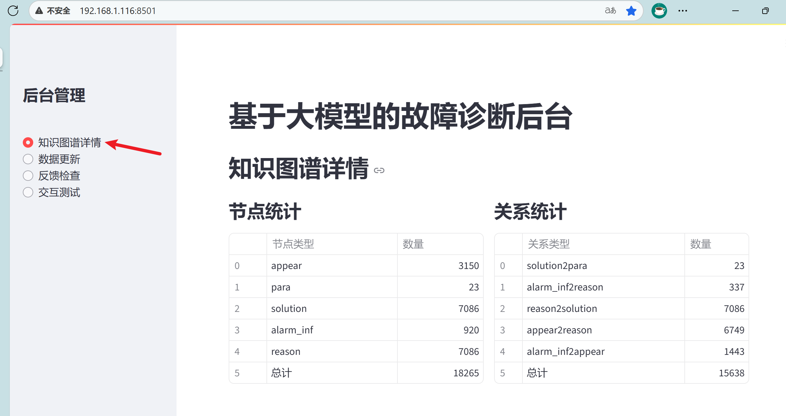
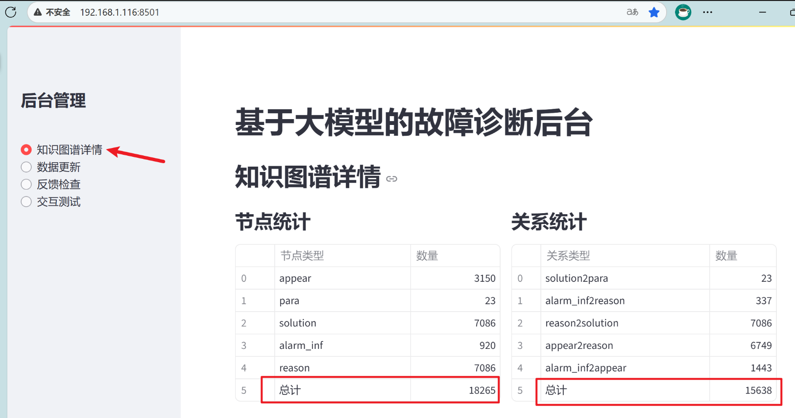
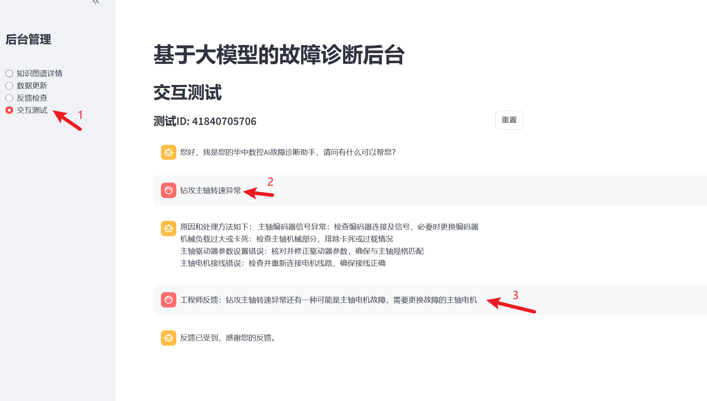
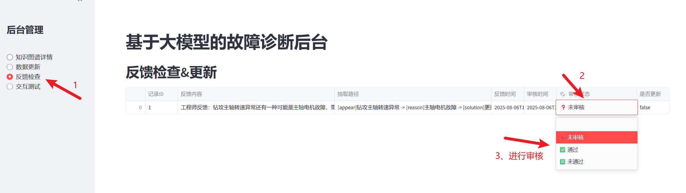
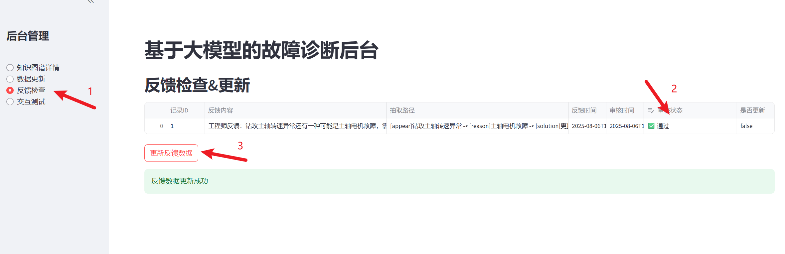
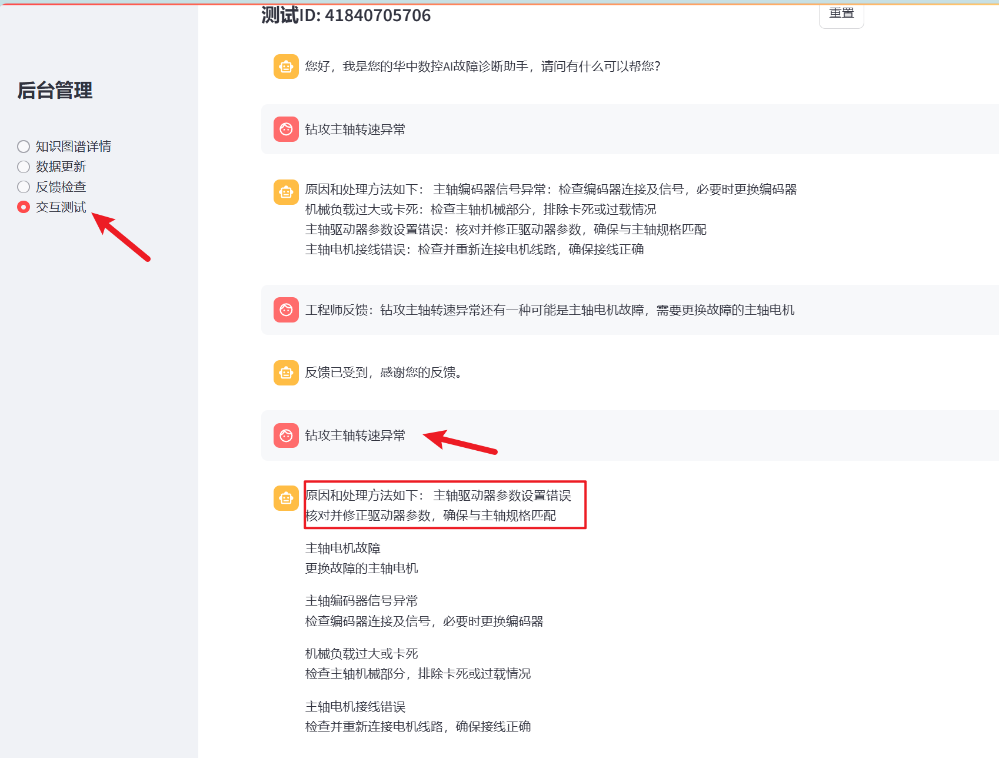
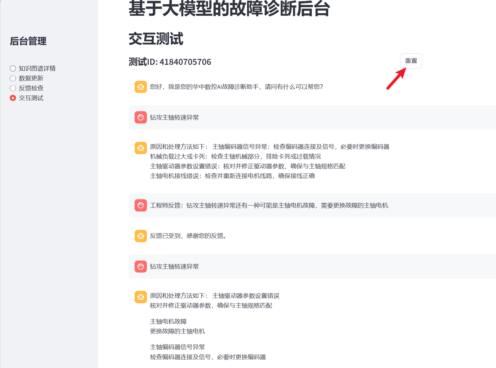
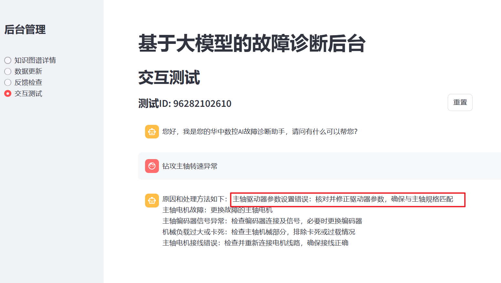

# 基于大模型的故障诊断系统使用手册

[TOC]

## 前言

### 系统简介
本系统是华中数控AI故障诊断助手，基于大模型和知识图谱技术，为用户提供机床故障诊断支持，可帮助快速查询故障原因及处理方法、更新故障数据、反馈补充故障信息等。

### 访问地址
系统后台网址：`http://localhost:8501/`

### 使用前提
- 需使用浏览器访问上述网址（推荐Chrome、Edge等主流浏览器）；
- 进行数据更新或反馈操作时，需具备相应的操作权限（如工程师账号）。

## 一、知识图谱详情
### 功能说明
展示系统知识图谱的节点和关系统计信息，帮助用户了解当前故障诊断知识的覆盖范围。

### 操作步骤
1. 登录系统后，在左侧功能栏点击【知识图谱详情】；

1. 页面将显示两部分内容：
   - **节点统计**：包含各类节点（如alarm_inf、reason、solution等）的类型及对应数量；
   - **关系统计**：包含各类关系（如alarm_inf2reason、reason2solution等）的类型及对应数量；
2. 可直观查看总计节点数和总计关系数，了解知识图谱的规模。

## 二、交互测试
### 功能说明
模拟用户与AI故障诊断助手的对话场景，用于查询故障原因及处理方法。

### 操作步骤

1. 在左侧功能栏点击【交互测试】，进入对话页面；
2. 页面显示AI助手提示语：“您好，我是您的华中数控AI故障诊断助手，请问有什么可以帮您？”；
3. 输入故障问题（如“主轴超速报警”），点击发送；
4. 系统会根据问题提供相关选项（如故障出现的场景）或直接返回原因及处理方法（如“主轴编码器线缆存在故障，检查并更换主轴编码器线缆”）；
5. 若需开始新对话，点击页面中的【重置】按钮，将生成新的测试ID并清空历史对话。

## 三、数据更新
### 功能说明
支持上传机床厂专属故障与解决方案数据，更新系统知识图谱，提升诊断准确性。

### 1. 上传数据
#### 操作步骤

1. 在左侧功能栏点击【数据更新】，进入上传页面；
2. 页面提示“请上传基于模板文件填写的故障案例数据”，支持两种上传方式：
   - 拖拽文件至“Drag and drop file here”区域；
   - 点击【Browse files】，在本地文件夹中选择文件；
3. 注意事项：
   - 支持文件格式为xlsx；
   - 单个文件大小不超过200MB；
   - 需按照系统提供的模板填写数据（模板可联系管理员获取）。
   
   

### 2. 更新知识图谱
#### 操作步骤

1. 上传文件后，页面显示“文件保存成功”；
2. 点击【更新知识图谱】，系统将自动处理上传数据；
3. 处理完成后，页面提示“知识图谱更新成功”，并显示更新结果：
   - 新增记录数、新增节点数、新增关系数；
   - 无效记录数（若有不符合模板的数据，会标注为无效记录）。
   
   

### 3. 更新前后对比
更新完成后，可返回【知识图谱详情】页面，对比更新前后的节点统计和关系统计数据，查看新增的节点和关系。
- 数据更新前

- 数据更新后

## 四、反馈检查
### 功能说明
支持工程师反馈新的故障原因及处理方法，经审核后更新至知识图谱，补充系统知识。

### 1. 工程师发起反馈
#### 操作步骤

1. 在左侧功能栏点击【反馈检查】，进入反馈页面；
2. 先输入已有故障问题（如“钻攻主轴转速异常”），系统会返回当前的原因及处理方法；
3. 输入反馈内容（如“钻攻主轴转速异常还有一种可能是主轴电机故障，需要更换故障的主轴电机”）；
4. 系统提示“反馈已收到，感谢您的反馈”，完成反馈提交。

### 2. 反馈审核与更新
#### 操作步骤

1. 管理员在【反馈检查】页面的“反馈检查&更新”区域，可查看待审核的反馈记录，包含记录ID、反馈内容、抽取路径、反馈时间等；
2. 选择审核状态：
   - 点击【通过】：反馈内容将被保存到知识图谱；
   - 点击【未通过】：反馈内容不保存；
3. 审核通过后，点击【更新反馈数据】，系统提示“反馈数据更新成功”；

1. 可在【知识图谱详情】中查看更新后的节点和关系变化（如新增reason节点“主轴电机故障”及对应关系）。
- 反馈更新前知识图谱详情

- 反馈更新后知识图谱详情

### 3. 反馈后验证
更新完成后，在【交互测试】中重新提问该故障问题（如“钻攻主轴转速异常”），系统会包含新增的原因及处理方法，验证反馈是否生效。
- 同步提问

- 后续用户也能得到反馈后的故障解决方法

重置

提问

## 常见问题	

1. **上传文件失败怎么办？**  
   检查文件格式（需为xlsx）、大小（不超过200MB），并确认文件内容符合模板要求（如表头正确、无缺失值）。

2. **反馈审核未通过的可能原因？**  
   反馈内容与现有知识冲突、描述不清晰或不符合故障诊断逻辑，可修改后重新提交。

3. **如何确认知识图谱已更新？**  
   数据更新或反馈更新后，可在【知识图谱详情】中对比更新前后的节点数和关系数，或通过【交互测试】验证新增内容是否生效。

## 附则

### 一、Neo4j服务器使用说明
1. **访问知识图谱**
   - 打开浏览器，输入地址：`http://localhost:7474`
   - 连接成功后进入Neo4j Browser界面，可直观查看知识图谱结构

2. **常用查询命令**
   - 查询所有节点：`MATCH (n) RETURN n`
   - 按节点类型查询（如报警信息）：`MATCH (n:alarm_inf) RETURN n`
   - 按节点名称查询（如主轴超速报警）：`MATCH (n:alarm_inf {name:"主轴超速报警"}) RETURN n`
   - 验证上传结果：上传数据后，通过上述命令查询新增节点（如`appear`类型节点），确认是否包含上传的故障现象

3. **参考网站**
   - Neo4j官方文档：`https://neo4j.com/docs/`
   - Cypher查询语言教程：`https://neo4j.com/developer/cypher/`
   - Neo4j社区论坛：`https://community.neo4j.com/`

### 二、持续优化
本手册将根据系统更新持续优化，如有操作疑问，可联系系统管理员获取支持。