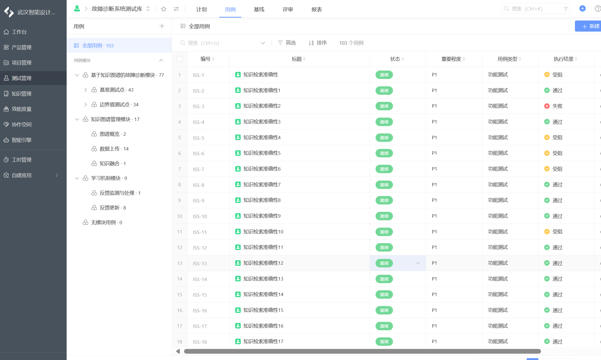
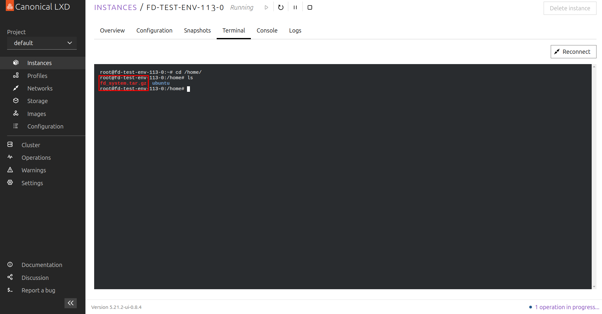

# 故障诊断系统手册

[TOC]

## 总体大纲
- 软件开发方法：快速原型

- 设计流程：

  需求文档-设计文档-开发-测试-部署

- 迭代流程

 
 要点说明
（1）绿色为测试控制、紫色为开发控制、黄色运维控制

（2）Bug状态说明
1、打开（open）
2、已解决（resolved）
3、重新打开（reopen）
4、关闭（closed）
● 开发只能对Bug状态进行“已解决”的修改
● 测试对Bug状态进行打开与关闭的操作

（3）Bug的解决方案
1、已修复（fixed）
2、不予修复（won't fix）
3、推迟修复（postpone）
4、无法重现（not repro）
5、重复（duplicate）
6、设计如此（by design）
7、外部原因（external）
8、其他（other，如数据原因，环境原因，配置原因等）
● 只能由开发人员填写Bug的解决方案

（4）流程控制
当Bug状态变为已解决和关闭时，Bug的解决方案为必填字段，否则不能改变状态
当Bug状态变为打开或重新打开时，清空Bug的解决方案字段


## 1. 开发

经过探索，大模型在智能化数控系统多个场景得到应用，如：加工参数辅助生成、智能编程、人机交互、故障诊断、

- 技术方案选型


- 系统架构


- 数据流架构
 

- 通信流程
  
  
- 镜像（部分）


## 2. 测试
### 2.1 测试大纲


### 2.2 测试平台


### 2.3 Bug管理


## 3. 部署

### 3.1 部署准备

1. 硬件资源


2. 软件环境
    - 操作系统：ubuntu 22.04
    - GPU驱动：nvidia-driver-550
    - 容器化工具：Docker, Docker-compose, nvidia-container-runtime
    - 网络环境：外网可访问

3. 镜像版本(**所有镜像由HS提供**)
    - 镜像
        * **mysql**
            * 镜像:版本 - mysql:5.7
        * **neo4j**
            * 镜像:版本 - neo4j:5.17-community
        * **qdrant**
            * 镜像:版本 - qdrant/qdrant:v1.10.0
        * **redis**
            * 镜像:版本 - redis:6.0.16
        * **chat_server**
            * 镜像:版本 - chat_server:1.3
            * 简介：用于运行大模型的环境，其中包含大模型的模型文件
        * **embed_server**
            * 镜像:版本 - embed_server:v1.0
            * 简介：用于运行数据向量化的环境，其中包含模型文件
        * **baseenv**
            * 镜像:版本 - iss/baseenv:v1.9
            * 简介：用于运行后端服务的环境
4. 部署地址
   - 网络：wifi连接-NERC-INTERNAL   wifi密码：Nerc@123
   - 网址：https://192.168.69.150
   - 账号：名字拼音 密码：Nerc@名字首字母小写 root密码：Nerc@名字首字母小写

### 3.2 部署方法

1. 将系统压缩包复制到/home/目录下

    ```shell
   # path : /home/
   # └── fd_system.tar.gz
   ```
   

2. 解压系统压缩包

    ```shell
    # path : /home/
    tar -zxvf fd_system.tar.gz
    cd fd_system
    tree -L 2
    
    # 解压后的目录：
    # └── fd_system
    #     ├── chat_server
    #     ├── con_server
    #     ├── docker-compose.yml
    #     ├── fd_backend
    #     ├── fd_data
    #     ├── fd_embed
    #     ├── image
    #     │   ├── mysql_5_7.tar
    #     │   ├── neo4j_5_17_community.tar
    #     │   ├── qdrant_v1_10_0.tar
    #     │   ├── redis_6_0_16.tar
    #     │   ├── chat_server_1_3.tar
    #     │   ├── embed_server_v1_0.tar
    #     │   └── baseenv_v1_9.tar
    #     ├── interaction
    #     ├── kg
    #     └── webui
    ```
   
   

3. 载入镜像及数据卷
    ```shell
    # path /home/fd_system
    sudo ./load_image.sh
    ```
   **注意**：载入镜像及数据卷需要一定时间，请耐心等待
   

4. 基于docker compose启动服务

    ```shell
    # path /home/fd_system
    sudo docker-compose up -d
    ```
   


## 4. 使用情况
### 4.1 华中数控使用情况


日常工程师咨询较多的案例


### 4.2 使用案例
远程桌面+大模型
- 大模型解决一些常见直观的问题
- 和远程桌面结合，解决一些常见参数优化和调整的问题
提供真正的远程故障处理手段。


### 4.2 大模型带来的帮助与不足
**帮助**
- 经验案例的共享，尤其对经验相对不丰富的人员可以通过平台获取他人经验参考。相同故障案例直接引用，提升现场故障判断的效率

- 对一些产品知识点可以快速的查询，免去查找说明书等复杂过程

- 结合远程桌面功能，更快提供问题处理

**待改进**
- 用户方使用积极性不高，传统直接打电话、微信和系统方沟通的形式还是主流，使用大模型的习惯还需要慢慢的培养。 
- 习惯培养的过程，就需要大模型提供的答复越来越精准，这点大模型知识库还需要改进。

## 5. 后续工作
### 5.1 目的
现阶段故障诊断系统知识质量不足，针对这一问题计划分两个阶段，与华中数控工程师进行故障诊断数据审核。

第一阶段（25年7月底~25年9月底）：聚焦伺服驱动领域高频报警数据和常见故障案例
第二阶段（25年10月初~25年12月底）：聚焦其他工单数据和案例数据

### 5.2 计划
