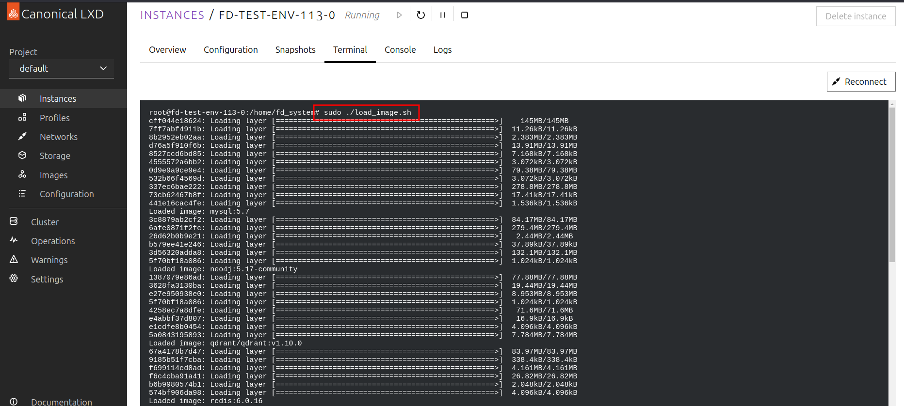

## 1.部署

### 1.1 部署准备

1. 硬件资源


2. 软件环境
    - 操作系统：ubuntu 22.04
    - GPU驱动：nvidia-driver-550
    - 容器化工具：Docker, Docker-compose, nvidia-container-runtime
    - 网络环境：外网可访问

3. 镜像版本(**所有镜像由HS提供**)
    - 镜像
        * **mysql**
            * 镜像:版本 - mysql:5.7
        * **neo4j**
            * 镜像:版本 - neo4j:5.17-community
        * **qdrant**
            * 镜像:版本 - qdrant/qdrant:v1.10.0
        * **redis**
            * 镜像:版本 - redis:6.0.16
        * **chat_server**
            * 镜像:版本 - chat_server:1.3
            * 简介：用于运行大模型的环境，其中包含大模型的模型文件
        * **embed_server**
            * 镜像:版本 - embed_server:v1.0
            * 简介：用于运行数据向量化的环境，其中包含模型文件
        * **baseenv**
            * 镜像:版本 - iss/baseenv:v1.9
            * 简介：用于运行后端服务的环境
4. 部署地址
   - 网络：wifi连接-NERC-INTERNAL   wifi密码：Nerc@123
   - 网址：https://192.168.69.150
   - 账号：名字拼音 密码：Nerc@名字首字母小写 root密码：Nerc@名字首字母小写

### 1.2 部署方法

1. 将系统压缩包复制到/home/目录下

    ```shell
   # path : /home/
   # └── fd_system.tar.gz
   ```
   

2. 解压系统压缩包

    ```shell
    # path : /home/
    tar -zxvf fd_system.tar.gz
    cd fd_system
    tree -L 2
  
    # 解压后的目录：
    # └── fd_system
    #     ├── chat_server
    #     ├── con_server
    #     ├── docker-compose.yml
    #     ├── fd_backend
    #     ├── fd_data
    #     ├── fd_embed
    #     ├── image
    #     │   ├── mysql_5_7.tar
    #     │   ├── neo4j_5_17_community.tar
    #     │   ├── qdrant_v1_10_0.tar
    #     │   ├── redis_6_0_16.tar
    #     │   ├── chat_server_1_3.tar
    #     │   ├── embed_server_v1_0.tar
    #     │   └── baseenv_v1_9.tar
    #     ├── interaction
    #     ├── kg
    #     └── webui
    ```
   
   

3. 载入镜像及数据卷
    ```shell
    # path /home/fd_system
    sudo ./load_image.sh
    ```
   **注意**：载入镜像及数据卷需要一定时间，请耐心等待
   

4. 基于docker compose启动服务

    ```shell
    # path /home/fd_system
    sudo docker-compose up -d
    ```
   


5. 服务系统测试
   网址: http://localhost:8501
   **说明**：研讨会实操阶段不同人员的测试网址不同，由HS提供