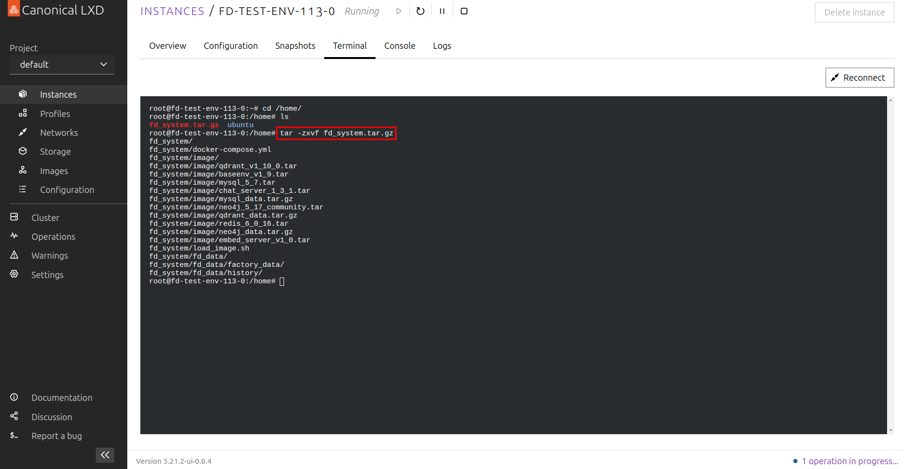
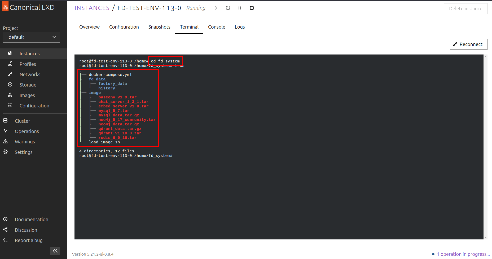
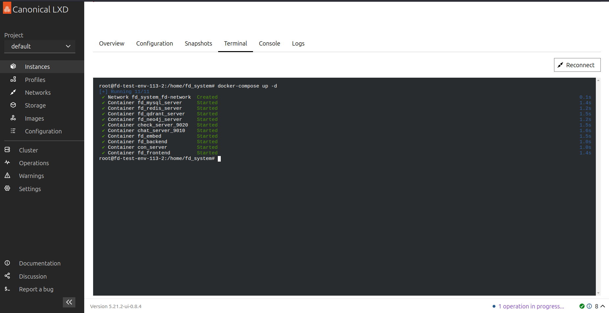

# 故障诊断系统安装部署手册（Linux环境）

[TOC]

（系统版本6.1）

| 版本 | 作者   | 修订内容 | 说明 | 完稿日期 |
| ---- | ------ | -------- | ---- | -------- |
| v1.0 | 雷汉生 | 初次编制 |      |          |
|      |        |          |      |          |
|      |        |          |      |          |

修订内容有如下几种：初次编制、增加（+ 增加说明）、修改（+ 修改说明）、删除（+ 删除说明）

## 第1章 前言
### 1.1 目的
指导内部运维部署人员完成系统在Linux环境下的部署工作，帮助快速上手操作。

### 1.2 术语与缩略语
|序号|术语、缩写|解释|
| ---- | ---- | ---- |
|1|Docker|一种容器化工具|
|2|Docker - compose|用于定义和运行多容器Docker应用程序的工具|

## 第2章 部署环境
### 2.1 系统部署结构
基于容器化部署，各服务通过Docker容器运行，相互协作构成系统。以下是 Docker 部署的高级架构图：


### 2.2 服务器配置
1. 硬件资源


2. 软件环境
    - 操作系统：ubuntu 22.04
    - GPU驱动：nvidia-driver-550
    - 容器化工具：Docker, Docker-compose, nvidia-container-runtime
    - 网络环境：外网可访问

### 2.3 客户端配置
无特殊客户端配置要求，通过浏览器访问系统即可。

### 2.4 实际环境配置记录
|序号|名称|内网IP|规格参数|操作系统|安装内容|
| ---- | ---- | ---- | ---- | ---- | ---- |
|1|部署服务器|192.168.69.150|两张4090显卡|ubuntu 22.04|Docker等相关软件及系统各服务|


## 第3章 系统安装与配置
### 3.1 总体说明
系统安装部署主要通过复制压缩包、解压、载入镜像、启动服务等步骤完成，按顺序执行即可。

### 3.2 数据库数据初始化
通过载入镜像及数据卷的脚本自动完成数据库数据初始化。

### 3.3 应用程序所有配置说明
无需额外修改配置文件，使用默认配置即可部署运行。

### 3.4 Linux系统应用程序部署启动
1. 将系统压缩包复制到/home/目录下

    ```shell
   # path : /home/
   # └── fd_system.tar.gz
   ```
   

2. 解压系统压缩包

    ```shell
    # path : /home/
    tar -zxvf fd_system.tar.gz
    cd fd_system
    tree -L 2
  
    # 解压后的目录：
    # └── fd_system
    #     ├── chat_server
    #     ├── con_server
    #     ├── docker-compose.yml
    #     ├── fd_backend
    #     ├── fd_data
    #     ├── fd_embed
    #     ├── image
    #     │   ├── mysql_5_7.tar
    #     │   ├── neo4j_5_17_community.tar
    #     │   ├── qdrant_v1_10_0.tar
    #     │   ├── redis_6_0_16.tar
    #     │   ├── chat_server_1_3.tar
    #     │   ├── embed_server_v1_0.tar
    #     │   └── baseenv_v1_9.tar
    #     ├── interaction
    #     ├── kg
    #     └── webui
    ```
   
   

3. 载入镜像及数据卷
    ```shell
    # path /home/fd_system
    sudo ./load_image.sh
    ```
   **注意**：载入镜像及数据卷需要一定时间，请耐心等待
   

4. 基于docker compose启动服务

    ```shell
    # path /home/fd_system
    sudo docker-compose up -d
    ```
   


### 3.5 访问验证及常见问题
- 服务系统测试网址：http://localhost:8501（研讨会实操阶段测试网址由HS提供）
- 部署地址相关信息：网络连接NERC - INTERNAL（密码Nerc@123），网址https://192.168.69.150，账号为名字拼音，密码及root密码为Nerc@名字首字母小写
- 常见问题：载入镜像及数据卷可能耗时较长，请耐心等待

### 3.6 自动更新服务部署
无自动更新服务部署相关内容。

### 3.7 自动服务部署
通过docker - compose启动服务后，服务将自动运行。